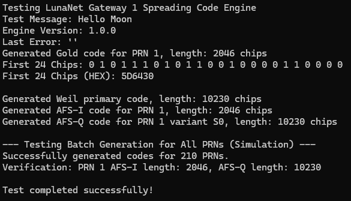

# LunaNet Spreading Codes

This repo contains the spreading codes used in the LunaNet protocol. The codes are generated using a pseudo-random sequence generator and are designed to provide good correlation properties for use in spread spectrum communication systems.

## Code Generation

The spreading codes are generated using a linear feedback shift register (LFSR) with a specific feedback polynomial. The LFSR is initialized with a seed value and produces a sequence of bits that can be used as spreading codes.

