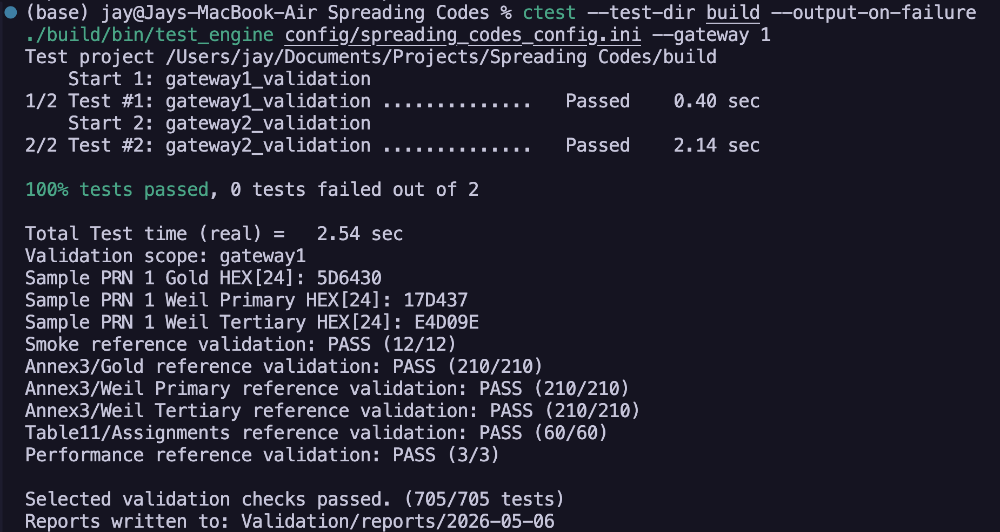
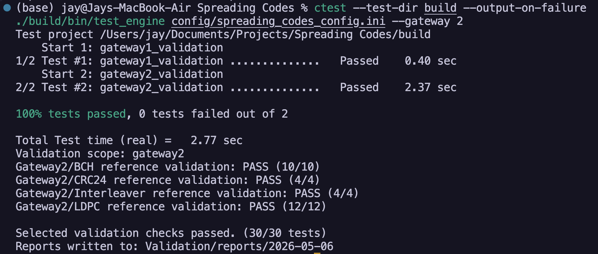

<!-- markdownlint-disable MD060 -->

> [!IMPORTANT]
> Historical draft snapshot.
> This submission draft reflects the repository state at the time it was prepared and can diverge from current implementation status.
> Use root `README.md` and latest `Validation/reports/` outputs for current status.

# LSIS-AFS Competition - Submission Report (Current Stage Draft)

This draft is completed to the current implementation stage in this repository. Unknown team-specific fields are marked TBD for you to finalize.

---

## Team Information

| Field                     | Details                                                                       |
| ------------------------- | ----------------------------------------------------------------------------- |
| Team Name                 | KURE-x-Tech                                                                   |
| Members                   | 7                                                                             |
| Institution / Affiliation | Kingston University                                                           |
| Contact Email             | TBD                                                                           |
| Repository URL            | [KURE-x-Tech/Spreading-Codes](https://github.com/KURE-x-Tech/Spreading-Codes) |

---

## Implementation Overview

### Language & Technology Stack

| Component          | Choice                                                                |
| ------------------ | --------------------------------------------------------------------- |
| Primary Language   | C++17 (core), Python 3 (bridge and tooling)                           |
| Build System       | CMake                                                                 |
| Key Libraries      | C++ standard library, Python standard library (ctypes, tkinter)       |
| Test Framework     | Custom C++ test harness + CTest registration, Python smoke script     |
| Platform(s) Tested | macOS (current workspace); cross-platform targets configured in CMake |

### Architecture Summary

The codebase is organized into modular gateways under codes/. Gateway 1 provides spreading-code generation (Gold, Weil primary, Weil tertiary, tiered AFS-Q) and configuration/table loading from docs/spec_tables via config/spreading_codes_config.ini. The public API surface is implemented in codes/spreading_codes.cpp and exported through a C ABI in codes/c_api.cpp.

Gateway 2 is implemented as a separate static library (lunanet_gateway2) and includes BCH, CRC-24Q, LDPC encoding, and block interleaving components. The main shared library (lunanet_spreading_codes) links Gateway 1 and Gateway 2 capabilities. A standalone test executable (test_engine) orchestrates smoke, Annex3 compliance, Table 11 assignment checks, Gateway 2 algorithm checks, and performance checks.

Python tooling wraps the C API with ctypes (codes/python/lunanet.py), provides a smoke script (codes/python/test_bridge.py), and includes a BPSK(1) I/Q generator (codes/python/iq_generator.py). A Tkinter report viewer (codes/gateway1/gui/report_viewer.py) visualizes markdown and JUnit XML test reports.

---

## Build & Run Instructions

### Prerequisites

macOS (Homebrew):

```bash
xcode-select --install
brew install cmake ninja python
```

Ubuntu/Debian:

```bash
sudo apt update
sudo apt install -y build-essential cmake ninja-build python3 python3-pip python3-tk
```

Python dependencies:

```bash
# No third-party pip dependencies are required for core workflows.
python3 --version
```

### Build

```bash
cmake -S . -B build -G Ninja -DCMAKE_BUILD_TYPE=Release
cmake --build build
```

Alternative generator-agnostic flow:

```bash
cmake -S . -B build
cmake --build build --config Release
```

### Run Tests

```bash
ctest --test-dir build --output-on-failure
./build/bin/test_engine config/spreading_codes_config.ini
```

### Run Examples

```bash
python3 codes/python/test_bridge.py
```

```bash
python3 codes/python/iq_generator.py \
  --config config/spreading_codes_config.ini \
  --prn 1 \
  --output Validation/iq_output \
  --format both
```

```bash
python3 codes/gateway1/gui/report_viewer.py
```

---

## Gateway Status

| Gateway                        | Status                      | Notes                                                                                                                                                          |
| ------------------------------ | --------------------------- | -------------------------------------------------------------------------------------------------------------------------------------------------------------- |
| 0 - Design & Architecture      | Partial                     | Architecture, requirements, and docs are present, but final submission packaging is still in progress.                                                         |
| 1 - Spreading Code Generation  | Complete                    | Annex3 validation for Gold/Weil primary/Weil tertiary and Table 11 checks are implemented and reported passing in README.                                      |
| 2 - Forward Error Correction   | Complete (Encoding-focused) | BCH, CRC-24, interleaver, and LDPC encoding tests are implemented and reported passing; LDPC decoding and BER qualification remain out of scope at this stage. |
| 3 - Navigation Message Framing | Not Attempted               | README roadmap still marks frame assembly as pending.                                                                                                          |
| 4 - Baseband Signal Generation | Partial                     | BPSK I/Q generation tooling exists for spreading-code-based sample output, but full frame-timed baseband pipeline is not complete.                             |
| 5 - Frame Sync & Decoding      | Not Attempted               | No implemented frame sync + full decode pipeline yet.                                                                                                          |
| 6 - Message Parsing            | Not Attempted               | No subframe parser pipeline yet.                                                                                                                               |
| 7 - Integration & Validation   | Partial                     | Strong module-level validation exists (735 tests reported), but full round-trip frame pipeline is not complete.                                                |
| 8 - Documentation & Examples   | Partial                     | README, docs, Python examples, and report viewer are present; final submission report completion is in progress.                                               |

---

## Validation Results

### Gateway 1: Spreading Codes

| Check                                           | Pass/Fail | Evidence                                                                                                                                                                      |
| ----------------------------------------------- | --------- | ----------------------------------------------------------------------------------------------------------------------------------------------------------------------------- |
| Gold codes match Annex3 (all 210 PRNs)          | Pass      | [GW1 Results](Validation/reports/2026-05-06/15-20-59_gateway1.md) - Annex3/Gold: 210 pass, 0 fail and testsuite failures=0                                                    |
| Weil primary codes match Annex3 (all 210 PRNs)  | Pass      | [GW1 Results](Validation/reports/2026-05-06/15-20-59_gateway1.md) - Annex3/Weil Primary: 210 pass, 0 fail and testsuite failures=0                                            |
| Weil tertiary codes match Annex3 (all 210 PRNs) | Pass      | [GW1 Results](Validation/reports/2026-05-06/15-20-59_gateway1.md) - Annex3/Weil Tertiary: 210 pass, 0 fail and testsuite failures=0                                           |
| Secondary codes match Table 10                  | Pass      | [GW1 Results](Validation/reports/2026-05-06/15-20-59_gateway1.md) - Table11/Assignments: 60 pass, 0 fail and testsuite failures=0                                             |
| Tiered codes maintain coherency                 | Pass      | [GW1 Results](Validation/reports/2026-05-06/15-20-59_gateway1.md) - Table11/Assignments: 60 pass, 0 fail and testsuite failures=0                                             |
| Code lengths match Table 9                      | Pass      | [GW1 Results](Validation/reports/2026-05-06/15-20-59_gateway1.xml) - Smoke testcases: Gold code length PRN 1, Weil primary length PRN 1, Weil tertiary length PRN 1; all pass |
| Generation time < 1s per PRN                    | Pass      | [GW1 Results](Validation/reports/2026-05-06/15-20-59_gateway1.md) - Performance: 3 pass, 0 fail and Performance testsuite failures=0 with per-PRN generation checks           |

> [!Note]
> The first command (`ctest`) tests the gateways to ensure they pass before proceeding to the next stage. If all pass, a proper validation test can occur for that gateway



### Gateway 2: Forward Error Correction

| Check                                          | Pass/Fail    | Evidence                                                                                                                                                                              |
| ---------------------------------------------- | ------------ | ------------------------------------------------------------------------------------------------------------------------------------------------------------------------------------- |
| BCH encoder produces valid 52-symbol codewords | Pass         | [GW2 Results](Validation/reports/2026-05-06/15-21-04_gateway2.md) - Gateway2/BCH: 10 pass, 0 fail and testsuite failures=0                                                            |
| LDPC encoder produces valid codewords          | Pass         | [GW2 Results](Validation/reports/2026-05-06/15-21-04_gateway2.md) - Gateway2/LDPC: 12 pass, 0 fail and testsuite failures=0                                                           |
| LDPC puncturing handled correctly              | Partial Pass | [GW2 Results](Validation/reports/2026-05-06/15-21-04_gateway2.xml) - LDPC encode output and size checks pass; puncturing is evidenced indirectly via expected output-symbol testcases |
| CRC-24 matches specification                   | Pass         | [GW2 Results](Validation/reports/2026-05-06/15-21-04_gateway2.md) - Gateway2/CRC24: 4 pass, 0 fail and testsuite failures=0                                                           |
| Interleaver pattern validated                  | Pass         | [GW2 Results](Validation/reports/2026-05-06/15-21-04_gateway2.md) - Gateway2/Interleaver: 4 pass, 0 fail and testsuite failures=0                                                     |
| Round-trip encode/decode recovers data         | Partial      | [GW2 Results](Validation/reports/2026-05-06/15-21-04_gateway2.xml) - BCH round-trip testcases (0x000..0x1FF) pass with failures=0; no LDPC decode tests appear in this report         |
| Encoding time < 100ms per frame                | Partial Pass | [GW2 Results](Validation/reports/2026-05-06/15-21-04_gateway2.xml) - Passing testcases include "SB2 encode < 100ms" and "SB3 encode < 100ms"; full frame-level timing is not present  |
| Decoding time < 1s per frame                   | Not Yet      | [GW2 Results](Validation/reports/2026-05-06/15-21-04_gateway2.md) - No frame decoding timing suite reported                                                                           |
| BER < 10^-5 at SNR > 0 dB                      | Not Yet      | [GW2 Results](Validation/reports/2026-05-06/15-21-04_gateway2.md) - No BER-vs-SNR suite reported                                                                                      |

> [!Note]
> The first command (`ctest`) tests the gateways to ensure they pass before proceeding to the next stage. If all pass, a proper validation test can occur for that gateway



### Gateway 3: Navigation Message Framing

| Check                                | Pass/Fail | Evidence                                                                                        |
| ------------------------------------ | --------- | ----------------------------------------------------------------------------------------------- |
| Frame structure matches Figure 9     | Not Yet   | [Reports Index](Validation/reports/2026-05-06/) - No Gateway 3 framing suite reported           |
| Symbol counts: 68 + 52 + 5880 = 6000 | Not Yet   | [Reports Index](Validation/reports/2026-05-06/) - No frame-assembly symbol-count suite reported |
| Bit allocations match spec tables    | Not Yet   | [Reports Index](Validation/reports/2026-05-06/) - No bit-allocation validation suite reported   |
| Frame duration is 12 seconds         | Not Yet   | [Reports Index](Validation/reports/2026-05-06/) - No frame-duration timing suite reported       |

### Gateway 4: Baseband Signal Generation

| Check                              | Pass/Fail         | Evidence                                                                                                                                           |
| ---------------------------------- | ----------------- | -------------------------------------------------------------------------------------------------------------------------------------------------- |
| I/Q samples correctly formatted    | Pass (Tool-level) | [IQ Generator](codes/python/iq_generator.py) - Outputs binary and CSV sample files                                                                 |
| AFS-I chip rate: 1.023 Mchip/s     | Partial           | [GW1 Results](Validation/reports/2026-05-06/15-20-59_gateway1.md) - Spreading-code checks pass, but timed modulation validation is not present     |
| AFS-Q chip rate: 5.115 Mchip/s     | Partial           | [GW1 Results](Validation/reports/2026-05-06/15-20-59_gateway1.md) - Tiered code checks pass, but chip-rate timing validation is not present        |
| Symbol rate: 500 symbols/s (AFS-I) | Partial           | [GW1 Results](Validation/reports/2026-05-06/15-20-59_gateway1.md) - Structural code generation passes; full frame-timed symbol pipeline is pending |
| Code synchronization correct       | Partial           | [GW1 Results](Validation/reports/2026-05-06/15-20-59_gateway1.md) - Table11/Assignments pass, but full frame sync chain is pending                 |
| Signal duration: 12 seconds        | Not Yet           | [IQ Generator](codes/python/iq_generator.py) - Current outputs are generated code-derived samples, not full framed 12s waveform validation         |

### Gateway 5: Frame Sync & Decoding

| Check                                    | Pass/Fail              | Evidence                                                                                                                 |
| ---------------------------------------- | ---------------------- | ------------------------------------------------------------------------------------------------------------------------ |
| Frame sync detection > 99% at SNR > 0 dB | Not Yet                | [GW2 Results](Validation/reports/2026-05-06/15-21-04_gateway2.md) - No frame sync suite reported                         |
| Decoders recover original data correctly | Not Yet                | [GW2 Results](Validation/reports/2026-05-06/15-21-04_gateway2.md) - No full decode-chain suite reported                  |
| CRC validation catches errors            | Partial (module-level) | [GW2 Results](Validation/reports/2026-05-06/15-21-04_gateway2.xml) - CRC testcase "Detect single bit corruption" passes  |
| LDPC converges in < 50 iterations        | Not Yet                | [GW2 Results](Validation/reports/2026-05-06/15-21-04_gateway2.md) - No LDPC decoder iteration-convergence suite reported |
| Decode time < 1s per frame               | Not Yet                | [GW2 Results](Validation/reports/2026-05-06/15-21-04_gateway2.md) - No frame decode timing suite reported                |

### Gateway 6: Message Parsing

| Check                                      | Pass/Fail | Evidence                                                                                    |
| ------------------------------------------ | --------- | ------------------------------------------------------------------------------------------- |
| All subframes parse correctly              | Not Yet   | [Reports Index](Validation/reports/2026-05-06/) - No parser suite reported                  |
| WN, ITOW, TOI fields extracted             | Not Yet   | [Reports Index](Validation/reports/2026-05-06/) - No field-extraction parser suite reported |
| Time of transmission calculated accurately | Not Yet   | [Reports Index](Validation/reports/2026-05-06/) - No ToT calculation parser suite reported  |
| All message types handled                  | Not Yet   | [Reports Index](Validation/reports/2026-05-06/) - No message parser coverage suite reported |

### Gateway 7: Integration & Validation

| Check                                       | Pass/Fail | Evidence                                                                                                                          |
| ------------------------------------------- | --------- | --------------------------------------------------------------------------------------------------------------------------------- |
| Round-trip recovers data with 100% accuracy | Not Yet   | [Reports Index](Validation/reports/2026-05-06/) - No end-to-end round-trip suite reported                                         |
| All 12 interim test codes working           | Pass      | [GW1 Results](Validation/reports/2026-05-06/15-20-59_gateway1.md) - Table11/Assignments: 60 pass, 0 fail and testsuite failures=0 |
| Process 12s frames in < 1 second            | Not Yet   | [Reports Index](Validation/reports/2026-05-06/) - No 12s frame processing performance suite reported                              |
| All "shall" requirements verified           | Not Yet   | [Reports Index](Validation/reports/2026-05-06/) - Full compliance closure suite not reported                                      |

---

## Performance Benchmarks

| Metric                     | Your Result                                                                                               | Target     |
| -------------------------- | --------------------------------------------------------------------------------------------------------- | ---------- |
| Code generation (per PRN)  | Pass (report-based): Performance suite 3/3 pass in 15-20-59_gateway1 (threshold check < 1s per PRN)       | < 1 second |
| Frame encoding (per frame) | Partial: 15-21-04_gateway2.xml has passing "SB2 encode < 100ms" and "SB3 encode < 100ms" component checks | < 100 ms   |
| Frame decoding (per frame) | Not measured (not implemented)                                                                            | < 1 second |
| Real-time factor           | Not measured                                                                                              | > 1x       |
| BER at SNR 0 dB            | Not measured                                                                                              | < 10^-5    |
| Frame sync reliability     | Not measured                                                                                              | > 99%      |
| Test coverage              | Functional tests: 735/735 pass combined from 15-20-59_gateway1 (705) + 15-21-04_gateway2 (30)             | > 90%      |

Benchmark methodology (current stage):

- Test harness: codes/test_engine.cpp.
- Timers: std::chrono::high_resolution_clock.
- Performance suite: PRNs {1, 105, 210} full generation pipeline, pass threshold < 1000 ms.
- LDPC component timing: SB2 and SB3/SB4 encode checks include < 100 ms assertions.
- Evidence baseline for this draft revision: Validation/reports/2026-05-06/15-20-59_gateway1.{md,xml} and Validation/reports/2026-05-06/15-21-04_gateway2.{md,xml}.
- Hardware/OS/compiler flags for official benchmarking run: TBD by final submitter.

---

## Interoperability (optional)

No external partner interoperability runs have been recorded in the repository at this stage.

| Partner Team | Test Performed | Result  |
| ------------ | -------------- | ------- |
| N/A          | N/A            | Not Yet |

---

## Test Summary

Category mapping below is derived from current suite structure in test_engine (not a separately emitted classifier in the harness).

| Category          | Total | Passing | Failing | Skipped |
| ----------------- | ----- | ------- | ------- | ------- |
| Unit tests        | 30    | 30      | 0       | 0       |
| Integration tests | 72    | 72      | 0       | 0       |
| Compliance tests  | 630   | 630     | 0       | 0       |
| Performance tests | 3     | 3       | 0       | 0       |

Evidence baseline for totals in this section: Validation/reports/2026-05-06/15-20-59_gateway1.md (705/705) plus Validation/reports/2026-05-06/15-21-04_gateway2.md (30/30), yielding 735/735.

---

## Known Limitations

- Full navigation message framing (Gateway 3) is not yet implemented.
- Full frame sync + decode pipeline (Gateway 5) is not yet implemented.
- Message parsing pipeline (Gateway 6) is not yet implemented.
- BER-vs-SNR and frame sync reliability benchmarks are not yet implemented.
- Interoperability partner testing is not yet performed.
- Current evidence baseline is the generated report pair from 2026-05-06 at 15-20-59 (Gateway 1) and 15-21-04 (Gateway 2).
- Team metadata fields (members/contact) still require final owner input.

---

## Innovation & Extras (optional)

- Thread-safe Legendre sequence caching for faster repeated Weil generation.
- Cross-language bridge: C API + Python ctypes wrapper for rapid scripting and tool integration.
- BPSK I/Q generation utility producing binary and CSV outputs.
- GUI report viewer for markdown + JUnit XML result inspection.

---

## File Manifest

| Path                                    | Description                                              |
| --------------------------------------- | -------------------------------------------------------- |
| README.md                               | Project overview, feature set, build/test usage, roadmap |
| docs/intern/SUBMISSION-current-stage.md | Current-stage submission draft (this file)               |
| CMakeLists.txt                          | Build system, target wiring, CTest registration          |
| codes/                                  | Core C++ implementation (Gateway 1 + Gateway 2 modules)  |
| codes/testing/                          | Test reporter, validators, Annex3 loader                 |
| codes/python/                           | Python bridge and utilities (smoke + I/Q generator)      |
| config/spreading_codes_config.ini       | Runtime configuration for table and Annex3 paths         |
| docs/spec_tables/                       | Spec-derived machine-readable tables                     |
| Validation/annex3/                      | Reference vectors and LDPC matrices                      |

---

## Self-Assessment

| Category (Points)        | Self-Score | Justification                                                                                                        |
| ------------------------ | ---------- | -------------------------------------------------------------------------------------------------------------------- |
| Correctness (40)         | 28/40      | Strong correctness evidence for Gateway 1 and Gateway 2 encoding components; decode/frame/parser stages not complete |
| Performance (20)         | 9/20       | Code generation and LDPC component timing checks exist; full-frame and decode performance not yet measured           |
| Completeness (20)        | 10/20      | Gateways 1 and 2 substantially implemented, Gateway 4 partially implemented, Gateways 3/5/6 pending                  |
| Code Quality (10)        | 8/10       | Modular architecture, dedicated test framework, C API and Python bridge, clear separation by gateway                 |
| Innovation & Extras (10) | 6/10       | Added report viewer, caching, and cross-language tooling beyond minimum core generators                              |
| **Total**                | **61/100** | Conservative current-stage estimate prior to full pipeline completion                                                |

---

## Additional Notes (optional)

- This document is a current-stage snapshot, not a final competition submission.
- Before final submission, run test_engine and attach generated markdown/XML report artifacts under Validation/reports.
- Finalize team metadata and replace any remaining TBD values.
